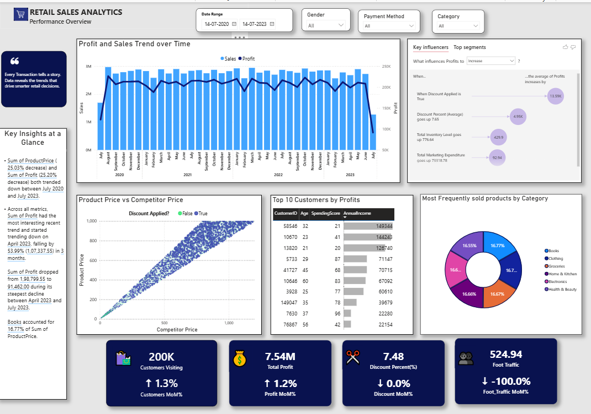

# Retail Sales Analytics Dashboard

**Interactive retail performance analysis developed in Microsoft Power BI**

This project presents an interactive dashboard for analyzing retail sales, profitability, customer performance, pricing, discounts, product categories, and transaction trends.

The dashboard combines multiple analytical views into a single reporting interface, allowing users to move from high-level performance indicators to customer-, product-, and transaction-level analysis.

---

## Dashboard Preview

  

---

## Project Overview

The objective of this project is to transform retail transaction data into a structured business intelligence dashboard.

The dashboard focuses on four broad areas:

| Area                  | Analysis                                          |
| --------------------- | ------------------------------------------------- |
| Sales & Profitability | Sales and profit trends across time               |
| Customer Analysis     | Top customers based on profit contribution        |
| Product & Pricing     | Product prices compared with competitor prices    |
| Business Drivers      | Factors associated with changes in average profit |

Interactive filters allow the analysis to be refined by **date range, gender, payment method, and product category**.

---

## Key Performance Indicators

<table>
<tr>
<td align="center" width="25%">
<strong>200K</strong> 
Customers Visiting
</td>
<td align="center" width="25%">
<strong>7.54M</strong> 
Total Profit
</td>
<td align="center" width="25%">
<strong>7.48%</strong> 
Discount Percentage
</td>
<td align="center" width="25%">
<strong>524.94</strong> 
Foot Traffic
</td>
</tr>
</table>

---

## Business Questions

The dashboard was designed to address questions such as:

1. How have sales and profit changed over time?
2. Which customers contribute most to overall profit?
3. How closely are product prices related to competitor prices?
4. What factors are associated with higher average profit?
5. How are frequently sold products distributed across categories?
6. How does applying a discount relate to profitability?
7. How does performance change across different customer and transaction characteristics?

---

## Dashboard Components

### 1. Sales & Profit Trend

The time-series visualization compares **Sales** and **Profit** across the selected period.

This provides an overview of:

* Changes in sales volume
* Profit fluctuations
* Periods of relatively higher or lower performance
* The relationship between sales and profitability over time

---

### 2. Key Influencers

The Key Influencers visual identifies variables associated with changes in the average profit measure.

The dashboard highlights factors such as:

* Discount application
* Average discount percentage
* Inventory levels
* Marketing expenditure

This section provides a driver-oriented view rather than simply reporting historical values.

---

### 3. Product Price vs Competitor Price

The scatter plot compares:

**Product Price** against **Competitor Price**

The visualization also distinguishes transactions based on whether a discount was applied.

This allows the relationship between internal pricing and competitor pricing to be examined visually.

---

### 4. Top 10 Customers by Profit

This section ranks customers according to their contribution to profit.

The table provides additional customer characteristics, including:

* Customer ID
* Age
* Spending Score
* Annual Income

This helps identify high-value customers within the dataset.

---

### 5. Product Category Distribution

The category visualization shows the distribution of frequently sold products across retail categories.

The dashboard includes categories such as:

* Books
* Clothing
* Groceries
* Home & Kitchen
* Electronics
* Health & Beauty

This provides a quick view of the relative contribution of different product categories.

---

## Interactive Filters

The dashboard includes interactive slicers for:

<table>
<tr>
<th>Filter</th>
<th>Purpose</th>
</tr>
<tr>
<td><strong>Date Range</strong></td>
<td>Analyze performance over a selected time period</td>
</tr>
<tr>
<td><strong>Gender</strong></td>
<td>Compare customer-related performance by gender</td>
</tr>
<tr>
<td><strong>Payment Method</strong></td>
<td>Analyze transactions by payment method</td>
</tr>
<tr>
<td><strong>Category</strong></td>
<td>Focus the analysis on specific product categories</td>
</tr>
</table>

---

## Key Observations

Based on the dashboard:

* Sales remain relatively consistent across much of the observed period, while profit shows greater variation.
* Discount application appears among the important factors associated with average profit in the Key Influencers analysis.
* Product price and competitor price exhibit a strong positive visual relationship.
* The Top 10 Customers analysis shows that profitability is concentrated among a subset of customers.
* Product activity is distributed across multiple retail categories.
* The dashboard allows these patterns to be examined dynamically using the available filters.

> **Note:** These observations describe patterns visible in the dashboard and should not be interpreted as causal relationships without further statistical analysis.

---

## Tools & Techniques

<table>
<tr>
<th>Tool / Technique</th>
<th>Application</th>
</tr>
<tr>
<td><strong>Microsoft Power BI</strong></td>
<td>Dashboard development and interactive reporting</td>
</tr>
<tr>
<td><strong>Power Query</strong></td>
<td>Data preparation and transformation</td>
</tr>
<tr>
<td><strong>DAX</strong></td>
<td>Measures and analytical calculations</td>
</tr>
<tr>
<td><strong>Data Visualization</strong></td>
<td>Charts, KPI cards, tables and analytical visuals</td>
</tr>
<tr>
<td><strong>Business Intelligence</strong></td>
<td>Converting transaction data into analytical insights</td>
</tr>
</table>

---

## Future Improvements

Potential extensions to the project include:

* Adding year-over-year growth measures
* Introducing additional customer segmentation
* Developing a dedicated sales performance page
* Adding profit-margin analysis
* Including drill-through pages for customer and product analysis
* Adding more detailed time-based comparisons

---

## Authors

- **Rizwana Washim** — [GitHub Profile](YOUR_GITHUB_LINK)(https://github.com/rizwana24washim)
- **Farhin Salam** — [[GitHub Profile](THEIR_GITHUB_LINK)](https://github.com/Farhin-1942)

This project is part of a portfolio demonstrating practical applications of data analysis, business intelligence, and data visualization.

---

## Data Source

The dashboard was developed using the Retail Sales dataset available on Kaggle.

**Source:** [[Kaggle — Retail Sales Dataset](ACTUAL-KAGGLE-LINK)](https://www.kaggle.com/datasets/abdurraziq01/retail-data)

**Data format:** CSV

**Data used for:** Sales analysis, profitability analysis, customer analysis,
product and pricing analysis, and dashboard development.

---

## Project Repository

The complete Power BI file and dashboard preview are available in this repository.
